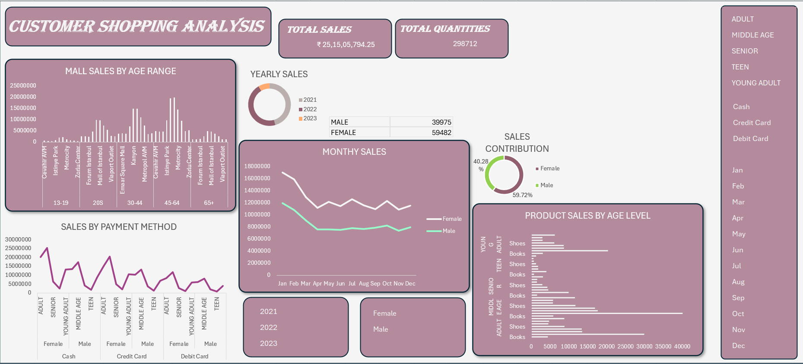

# 🛍 Customer Shopping Analysis Dashboard – Excel Project

## 📷 Dashboard Preview

## 📌 Project Overview

This project is an interactive Customer Shopping Analysis Dashboard built using Microsoft Excel.

The dashboard analyzes customer purchasing behavior across different:

Age groups

Gender

Payment methods

Time periods (Monthly & Yearly)

It helps businesses understand sales contribution patterns and customer segmentation.

## 🎯 Business Objective

Retail businesses need to understand:

Which age group contributes the most revenue

Gender-wise sales distribution

Preferred payment methods

Monthly and yearly sales trends

This dashboard provides a centralized analytical view for strategic decision-making.

## 🛠 Tools & Skills Used

Microsoft Excel

Pivot Tables

Pivot Charts

Slicers

KPI Cards

Data Cleaning

Interactive Dashboard Design

## 📊 Key KPIs

Total Sales: ₹ 25,15,05,794.25

Total Quantities Sold: 298,712

## 📈 Dashboard Insights

## 👥 Gender Contribution

Female customers contribute approximately 59.7% of total sales

Male customers contribute approximately 40.3%

## 📆 Monthly Sales Trend

Sales fluctuate throughout the year

Higher performance observed during the beginning and mid-year months

## 🎂 Age Group Analysis

Adults and Middle Age groups show strong purchasing power

Teens and Seniors contribute comparatively less

## 💳 Payment Method Analysis

Credit Card transactions show strong performance

Cash and Debit Card follow closely

Payment preference varies by age group

## 🏬 Mall Sales by Age Range

30–44 and 45–64 age groups generate higher mall sales

Younger customers show category-specific buying behavior (Shoes & Books)

## 🎛 Interactive Filters

The dashboard includes slicers for:

Age Group (Adult, Middle Age, Senior, Teen, Young Adult)

Payment Method (Cash, Credit Card, Debit Card)

Month (Jan–Dec)

Year (2021, 2022, 2023)

Gender (Male, Female)

Users can dynamically explore trends and segment-level performance.

## 💼 Skills Demonstrated

Customer Segmentation Analysis

KPI Reporting

Trend Analysis

Business Insight Generation

Interactive Dashboard Development

Data Storytelling
